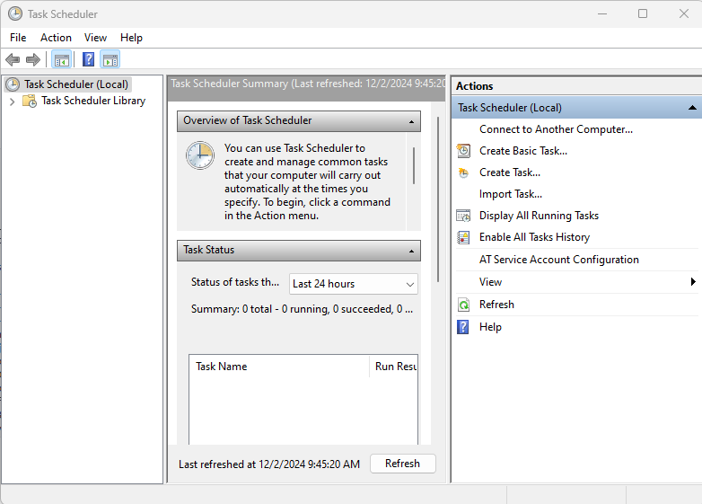
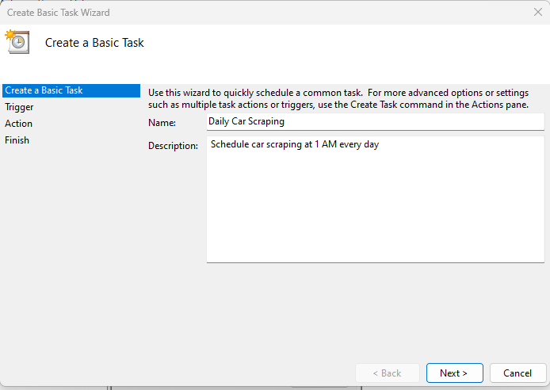
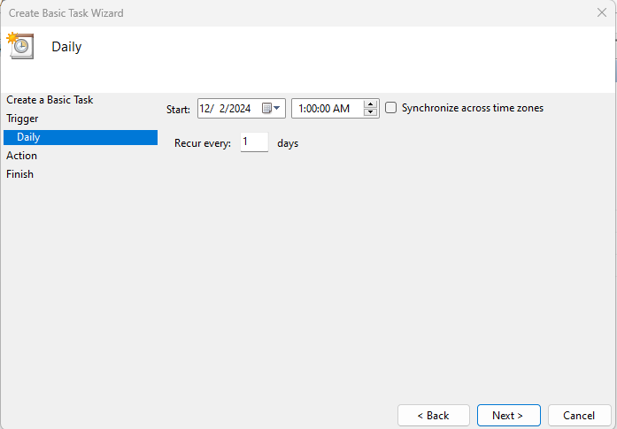
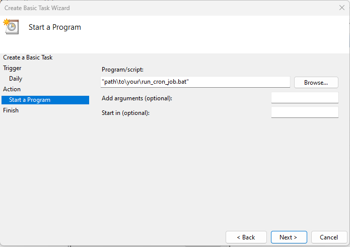
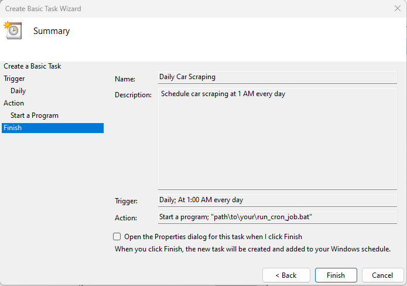
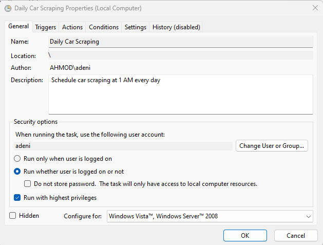
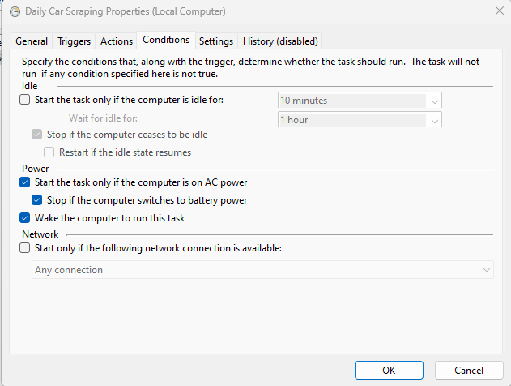

# Car Scraping Project

## Project Overview

This project is a web scraper designed to extract car prices and related data from the [Autochek Africa](https://autochek.africa/ng/cars-for-sale) website. The scraper automates the data collection process, runs daily at 1 AM local time, and stores the data incrementally for further analysis. The project includes monitoring and logging to track the scraping process and handle any errors or exceptions.

## Table of Contents

- [Project Overview](#project-overview)
- [Setup Instructions](#setup-instructions)
  - [Prerequisites](#prerequisites)
  - [Virtual Environment Setup](#virtual-environment-setup)
  - [Installing Dependencies](#installing-dependencies)
- [Usage Instructions](#usage-instructions)
  - [Running `cron_job.py` Manually](#running-cron_jobpy-manually)
  - [Setting Up the Batch File and Scheduled Task](#setting-up-the-batch-file-and-scheduled-task)
- [Scheduling Details](#scheduling-details)
  - [Configuring Windows Task Scheduler](#configuring-windows-task-scheduler)
- [Monitoring and Alerts](#monitoring-and-alerts)
  - [Logging](#logging)
- [Dependencies](#dependencies)
  - [Python Packages](#python-packages)
  - [System Dependencies](#system-dependencies)
- [Troubleshooting](#troubleshooting)
  - [Common Issues and Solutions](#common-issues-and-solutions)
- [Contributing](#contributing)
- [License](#license)

---

## Setup Instructions

### Prerequisites

- **Operating System**: Windows 10 or later
- **Python**: Version 3.7 or later
- **Google Chrome Browser**: Latest version
- **ChromeDriver**: Corresponding version to your Chrome browser

### Virtual Environment Setup

1. **Clone the Repository**

   ```bash
   git clone https://github.com/yourusername/car-scraping-project.git
   ```

2. **Navigate to the Project Directory**

   ```bash
   cd car-scraping-project
   ```

3. **Create a Virtual Environment**

   ```bash
   python -m venv venv
   ```

4. **Activate the Virtual Environment**

   ```batch
   venv\Scripts\activate
   ```

### Installing Dependencies

Install the required Python packages using `pip`:

```bash
pip install -r requirements.txt
```

---

## Usage Instructions

### Running `cron_job.py` Manually

1. **Activate the Virtual Environment**

   ```batch
   venv\Scripts\activate
   ```

2. **Navigate to the Project Directory**

   ```batch
   cd path\to\car-scraping-project
   ```

3. **Run the Script**

   ```bash
   python cron_job.py
   ```

4. **Monitor Output**

   - The script logs its progress to `scraping.log` and `cron_job.log`.
   - Scraped data is saved to `car_data.csv`.

### Setting Up the Batch File and Scheduled Task

#### **Creating `run_cron_job.bat`**

1. Open a text editor and create a new file named `run_cron_job.bat`.
2. Add the following content:

   ```batch
   @echo off
   REM Activate the virtual environment
   call "path\to\car-scraping-project\venv\Scripts\activate.bat"

   REM Navigate to the project directory
   cd /d "path\to\car-scraping-project"

   REM Run the Python script and redirect output to a log file
   python cron_job.py >> "path\to\car-scraping-project\cron_job.log" 2>&1

   REM Deactivate the virtual environment
   deactivate
   ```

3. Replace `path\to\car-scraping-project` with the actual path to your project directory.
4. Save the file in the project directory.

---

## Scheduling Details

### Configuring Windows Task Scheduler

1. **Open Task Scheduler**

   - Press `Win + R`, type `taskschd.msc`, and press **Enter**.

   

2. **Create a New Basic Task**

   - Click on **"Create Basic Task..."** in the **Actions** pane.
   - Name the task (e.g., `Daily Car Scraping`) and add a description.
   - Click **"Next"**.

   

3. **Set the Trigger**

   - Choose **"Daily"** and click **"Next"**.
   - Set the **Start** time to `1:00:00 AM`.
   - Click **"Next"**.

   

4. **Set the Action**

   - Choose **"Start a program"** and click **"Next"**.
   - **Program/script**: Browse to your `run_cron_job.bat` file.
   - Click **"Next"**.

   

5. **Finish and Configure**

   - Review the settings and check **"Open the Properties dialog for this task when I click Finish"**.
   - Click **"Finish"**.

   

6. **Configure Task Properties**

   - In the **General** tab, select **"Run whether user is logged on or not"**.
   - Check **"Run with highest privileges"**.

   
   - In the **Conditions** tab, check **"Wake the computer to run this task"**.

   
   - Click **"OK"** and enter your Windows credentials if prompted.

---

## Monitoring and Alerts

### Logging

- **Log Files**:

  - `scraping.log`: Logs the scraping process details.
  - `cron_job.log`: Logs the output and errors from `cron_job.py`.

- **Logging Levels**:

  - **INFO**: General operational information.
  - **ERROR**: Details of any errors encountered.

---

## Dependencies

### Python Packages

The required Python packages are listed in `requirements.txt`:

- `Flask`
- `selenium`
- `beautifulsoup4`
- `pandas`

### System Dependencies

- **Google Chrome Browser**: Latest version installed on your system.
- **ChromeDriver**:

  - Download the ChromeDriver that matches your Chrome browser version from [here](https://googlechromelabs.github.io/chrome-for-testing/#stable).
  - Place the `chromedriver.exe` file in a directory (e.g., `C:\webDrivers\`).
  - Update the `chrome_driver_path` variable in `cron_job.py`:

    ```python
    chrome_driver_path = "C:/webDrivers/chromedriver.exe"
    ```

---

## Troubleshooting

### Common Issues and Solutions

1. **Script Doesn't Run from Task Scheduler**

   - **Symptoms**: The task appears to run but the script doesn't execute.
   - **Solution**:
     - Ensure all file paths in `run_cron_job.bat` are correct and enclosed in quotes.
     - Check that the user account running the task has necessary permissions.

2. **ChromeDriver Errors**

   - **Symptoms**: `selenium.common.exceptions.WebDriverException` related to ChromeDriver.
   - **Solution**:
     - Verify that ChromeDriver matches your Chrome browser version.
     - Ensure `chrome_driver_path` in `cron_job.py` is correct.

3. **Permission Issues**

   - **Symptoms**: Access denied errors when writing files or logs.
   - **Solution**:
     - Run the Task Scheduler task with administrative privileges.
     - Check file and directory permissions.

4. **Data Not Being Saved**

   - **Symptoms**: `car_data.csv` is not updated.
   - **Solution**:
     - Check logs for errors during data scraping.
     - Ensure the script has write permissions to the project directory.

---

## Contributing

Contributions are welcome! Please follow these guidelines:

1. **Fork the Repository**

   - Create a personal fork of the project on GitHub.

2. **Clone the Fork**

   ```bash
   git clone https://github.com/yourusername/car-scraping-project.git
   ```

3. **Create a Feature Branch**

   ```bash
   git checkout -b feature/your-feature-name
   ```

4. **Make Changes and Commit**

   - Write clear and descriptive commit messages.
   - Ensure code follows the project's style guidelines.

5. **Push to Your Fork and Submit a Pull Request**

   ```bash
   git push origin feature/your-feature-name
   ```

6. **Submit Pull Request**

   - Describe the changes and link any related issues.

---


**Note**: Always ensure compliance with the website's terms of service and respect ethical guidelines when scraping data.